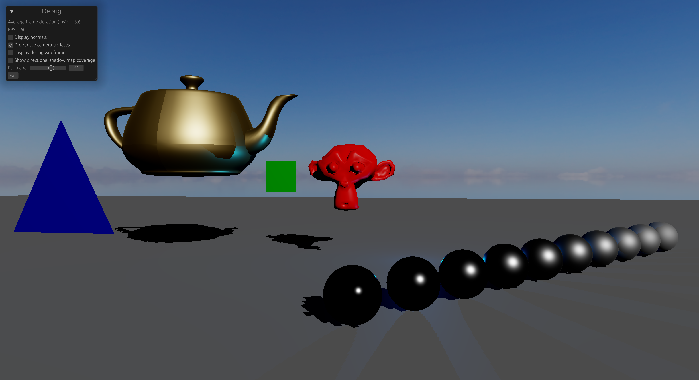

# Realtime 3D Graphics Fundamentals

The intent behind this project was to use a 3D graphics API to render more than [just a
triangle](https://vkguide.dev/docs/chapter_2), and learn some of the classic realistic
realtime rendering techniques. The main features I ended up with are:

* Physically-based shading
* High-dynamic rendering with automatic exposure and tone mapping
* Directional lights
  * With a shadow map fitted to the view frustum
* Point lights
  * With omnidirectional shadow maps
* HDRI skybox

I'm very happy with the progress I made over the ~6 weeks I spent on this. I feel like I've broken
through some conceptual barriers regarding computer graphics and graphics APIs. I'm better able to
use the GPU as a creative tool because I'm more familiar with the computing platform it offers and
the current 3D graphics API paradigm.

## Issues / future work

Learning more about computer graphics has meant realising that some of the
fundamentals aren't enough for creating realistic / physically plausible images.
I'm wrapping up this project because I feel like I've achieved everything I set out to,
and that means leaving it with a bunch of issues I couldn't have anticipated
when I started.

### Shadows

The most obvious issue in the screenshot is the directional light's shadow map resolution. The
camera frustum is quite large which lowers the effective resolution of the shadow map, leading to
very blocky shadows. Less obvious, but related, is extreme projective aliasing of shadows at
glancing angles. For the screenshot I chose a far plane and light direction that made this issue
less visible. Cascaded shadow maps seem like the next step toward improving the shadows. I'm also
curious whether one can then go from cascades (subdividing the view frustum along the Z axis) to
clusters (subdividing view frustum along X, Y, and Z, ala clustered shading) to get even more
precise use of shadow map resolution.

### Environment lighting

The HDRI skybox doesn't actually cast light onto the scene.
The black spheres are black because they aren't reflecting any of the sky's light.
The shadows are pure black for the same reason. With that amount and colour of ambient light, the shadows
should be lighter and tinted blue.

I would try improve environment lighting by handling specular and diffuse reflections separately.
The first step for specular reflections would be to reflect the skybox correctly. Each black sphere
should become a metallic sky-reflecting ball. I think I can do that without bringing in any new
concepts.
Next is to have the rest of the scene contribute to specular reflections, which seems to be where
the topic opens up. I think I'd start by playing with manually placed local reflection probes, and
maybe screen space reflections.

For diffuse environment reflections, I'd try creating an [irradiance
map](https://learnopengl.com/PBR/IBL/Diffuse-irradiance) from the HDRI.
Then I'd look to irradiance probes to capture how ambient light changes in response to the scene.
They seem really complicated, though.

### Test scenes

I'd love to be able to render common test scenes, such as [Crytek's
Sponza](https://www.cryengine.com/marketplace/product/crytek/sponza-sample-scene) ([super
sponza?](https://www.intel.com/content/www/us/en/developer/topic-technology/graphics-research/samples.html))
or the [Amazon Lumberyard bistro](https://developer.nvidia.com/orca/amazon-lumberyard-bistro). They
seem like the easiest way to get a realistic realtime scene so that I can check the quality and
efficiency of my rendering.

## A note on code quality

Since my goal was to learn realtime rendering, I chose to reduce my emphasis on writing good code. I
felt that it would be too easy for me to get distracted by software architecture (something more
familiar to me), at the expense of learning computer graphics. I biased toward repeating similar
code and hard-coding things, rather than creating abstractions. As a result, I
do not consider this code "production quality" - please keep that in mind if you read it.

## The rest of this document 

<!-- no toc -->
* [Goals](#goals) - I tracked my feature progress here.
* [Stretch goals](#stretch-goals) - Features that seemed cool but not "fundamental"; probably out of my reach this time around. 
* [For fun](#for-fun) - Features and ideas that weren't important for getting the renderer working,
  but seemed useful in a real world renderer, or just fun to build.
* [Resources](#resources) - The reference materials I relied on to figure all this out.

## Goals

* Remember GPU programming
  * [x] Basic render pass
  * [x] 2D rendering
* Render simple 3D objects in perspective
  * [x] Camera and perspective
  * [x] `.obj` model rendering (vertex positions)
  * [x] Per-object transformation matrix
  * [x] Depth testing
  * [x] Compute vertex normals when missing from `.obj` files
* Shade objects using physically-based techniques
  * [x] Include vertex normals
  * [x] Punctual and directional lights with diffuse reflectance
  * [x] Specular reflectance for dielectric materials
  * [x] Per-object material parameters (color, roughness)
  * [x] Metallic materials
  * [x] Physical light units, manual exposure
  * [x] Tone mapping
  * [x] Automatic exposure using average scene luminance
* Shadow mapping
  * [x] Basic shadow map for directional lights
  * [x] Omnidirectional shadow mapping (point lights)
  * [x] Light frustum fitting
* Environment mapping / image-based lighting
  * [x] HDRI skybox
* Use GPU-driven techniques as much as possible
  * [x] Per-object transformation matrices stored in a single GPU buffer
* [x] [`egui`](https://github.com/emilk/egui#-egui-an-easy-to-use-gui-in-pure-rust) integration
* [x] Auto-resize screen

## Stretch goals

* [ ] Anti-aliasing
* [ ] Ambient occlusion
* [ ] Bloom
* [ ] Area lights
* [ ] Histogram-based auto-exposure
* [ ] Parallax occlusion mapping
* [ ] Virtual/adaptive shadow maps
* [ ] `draw_indirect`

## For fun

* [ ] Parse-less on-disk model format with a program that converts to / from `.obj`
  
  To load meshes straight from `mmap`ped files.

* [ ] Render the depth buffer on screen
* Performance improvements
  * [ ] Indexed draws

## Resources

* Graphics programming on GPUs
  * <https://zdgeier.com/wgpuintro.html> - `wgpu` / `WGSL`
  * <https://sotrh.github.io/learn-wgpu/> - `wgpu` / `WGSL`
  * <https://vkguide.dev/> - `vulkan` / `GLSL`
  * <https://learnopengl.com/> `opengl` / `GLSL`
* Normal calculation
  * <https://computergraphics.stackexchange.com/questions/4031/programmatically-generating-vertex-normals>
  * <https://iquilezles.org/articles/normals/>
* Physically based shading
  * <https://interplayoflight.wordpress.com/2013/12/30/readings-on-physically-based-rendering/> -
    PBS literature master list 
  * <https://developer.nvidia.com/gpugems/gpugems3/part-iv-image-effects/chapter-24-importance-being-linear>
  * <https://renderwonk.com/blog/index.php/archive/adventures-with-gamma-correct-rendering/https://renderwonk.com/blog/index.php/archive/adventures-with-gamma-correct-rendering/>
  * <https://blog.selfshadow.com/publications/> - SIGGRAPH's "Physically Based Shading in Theory and
    Practise" series
    * <https://blog.selfshadow.com/publications/s2013-shading-course/hoffman/s2013_pbs_physics_math_notes.pdf> -
      Very clear introduction to physically based shading fundamentals
  * <https://www.realtimerendering.com/>
    * Chapter 9 - Physically Based Shading
  * <https://google.github.io/filament/Filament.html> - explanations of physically based rendering
    in the context of Google's [Filament](https://google.github.io/filament/) engine
  * Production implementations
    * Blender - <https://github.com/blender/blender/blob/main/source/blender/draw/engines/eevee/shaders/bsdf_common_lib.glsl>
    * Disney - <https://github.com/wdas/brdf/blob/main/src/brdfs/disney.brdf>
* HDR rendering
  * Exposure
    * <https://en.wikipedia.org/wiki/Film_speed>
    * <https://en.wikipedia.org/wiki/Exposure_(photography)>
    * <https://en.wikipedia.org/wiki/Exposure_value>
    * <https://en.wikipedia.org/wiki/Sunny_16_rule>
    * <https://seblagarde.wordpress.com/2015/07/14/siggraph-2014-moving-frostbite-to-physically-based-rendering/>
    * <https://placeholderart.wordpress.com/2014/11/21/implementing-a-physically-based-camera-manual-exposure/>
  * Tone mapping
    * <https://seenaburns.com/dynamic-range/>
    * <https://64.github.io/tonemapping/>
    * <http://filmicworlds.com/blog/filmic-tonemapping-operators/>
    * <http://filmicworlds.com/blog/why-a-filmic-curve-saturates-your-blacks/>
    * <http://filmicworlds.com/blog/filmic-tonemapping-with-piecewise-power-curves/>
    * <http://duikerresearch.com/2015/09/filmic-tonemapping-for-real-time-rendering/>
* Shadow mapping
  * <https://learnopengl.com/Advanced-Lighting/Shadows/Shadow-Mapping>
  * <https://developer.nvidia.com/gpugems/gpugems/part-ii-lighting-and-shadows/chapter-12-omnidirectional-shadow-mapping>
    * Cube map face selection
      * <https://stackoverflow.com/questions/6980530/selecting-the-face-of-a-cubemap-in-glsl>
      * <https://www.gamedev.net/forums/topic/687535-implementing-a-cube-map-lookup-function/5337472/>
  * Projection fitting
    * <https://learn.microsoft.com/en-us/windows/win32/dxtecharts/common-techniques-to-improve-shadow-depth-maps#techniques-to-improve-shadow-maps>
    * <https://gamedev.stackexchange.com/questions/73851/how-do-i-fit-the-camera-frustum-inside-directional-light-space>
    * <https://www.gamedev.net/forums/topic/591684-xna-40---shimmering-shadow-maps/>
* Depth buffer precision / logarithmic depth buffers
  * <https://outerra.blogspot.com/2009/08/logarithmic-z-buffer.html>
  * <https://www.gamedev.net/blog/73/entry-2006307-tip-of-the-day-logarithmic-zbuffer-artifacts-fix/>
  * <https://outerra.blogspot.com/2012/11/maximizing-depth-buffer-range-and.html>
  * <https://outerra.blogspot.com/2013/07/logarithmic-depth-buffer-optimizations.html>
  * <http://web.archive.org/web/20201113123351/https://thxforthefish.com/posts/reverse_z/>
* Test models
  * <https://github.com/alecjacobson/common-3d-test-models>
  * <http://graphics.stanford.edu/data/3Dscanrep/>
  * <https://www.cc.gatech.edu/projects/large_models/index.html>

    (change `www-static` to `www` on downloads)
  * [Utah teapot](https://en.wikipedia.org/wiki/Utah_teapot)
    * <https://graphics.stanford.edu/courses/cs148-10-summer/as3/code/as3/teapot.obj>
    * <https://graphics.cs.utah.edu/courses/cs6620/fall2013/prj05/teapot.obj>
  * [Stanford bunny](https://en.wikipedia.org/wiki/Stanford_bunny)
    * <https://graphics.stanford.edu/~mdfisher/Data/Meshes/bunny.obj>
* `.obj` parser: <https://crates.io/crates/tobj>